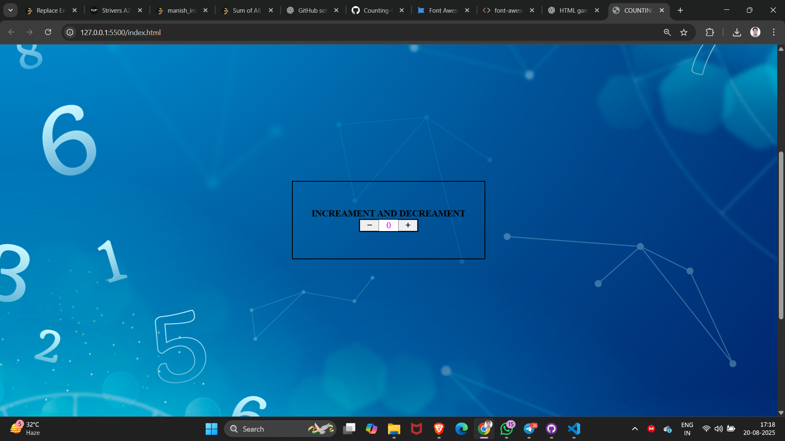

# 🧮 Counting Game  

A simple and fun web-based counter built using **HTML, CSS, and JavaScript**.  
Click the ➕ button to increase the count, and ➖ button to decrease it.  

---

## 📸 Preview  

Here’s how the game looks:  

<<<<<<< HEAD
  
=======
  
>>>>>>> 92691a2a56ec65d2dcf8aa289479d9b613f101ce

---

## 🚀 Live Demo  

👉 [Play Counting Game on GitHub Pages](https://manishinit26.github.io/Counting-Game/)  

*(Make sure you enable GitHub Pages in your repo: Settings → Pages → Deploy from branch → select `main` & `/ (root)`).*  

---

## ⚡ Features  

- Increment & decrement counter  
- Responsive design with styled buttons  
- Hover effects for better UX  

---

## 🛠️ How to Run Locally  

1. Clone this repository  
   ```bash
   git clone https://github.com/manishinit26/Counting-Game.git


##👨‍💻 Tech Stack

HTML5
CSS3
JavaScript (Vanilla)

🎯 Future Ideas

1.Add reset button
2.Add animations or sound effect
3.Track highest score
